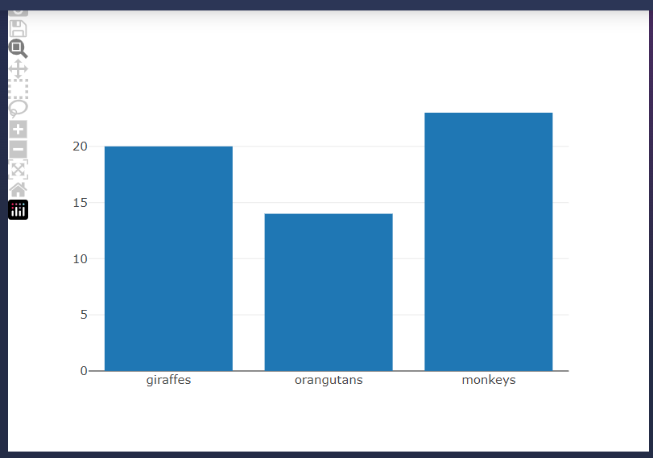

<script>
import Chart from './Chart.svelte'
import capture_path from '$lib/assets/Capture.JPG';
import pdflink from '$lib/assets/my-document.pdf';
import { assets } from '$app/paths';
import Seriously from './Seriously.md'

let assStr = String(assets)
</script>

## How I Stopped Worrying and Learned to Love Javascript

So I love [Jupyter Book](https://jupyterbook.org/en/stable/start/your-first-book.html). 
It's a great way to build a beautiful website with Python. 
You can add beautiful interactive charts with one of the many plotting libraries supported by Python
such as [Bokeh](https://bokeh.org/) or [Plotly](https://plotly.com/python/).

But if you want to make things REALLY interactive, you need to add some Javascript.
[Holoviz Panel](https://panel.holoviz.org/user_guide/Links.html#defining-javascript-callbacks) 
allows you to embed Javascript callbacks to charts and widgets which
can then be added to Jupyter Book. It's great! I've been experimenting with Panel for a while,
but I ended up learning so much Javascript that I started wondering why I don't just do everything in Javascript.

But then I remembered the beautiful LaTeX PDF documents I created with Jupyter Book,
and decided to stick with Python.

But then I learned about [Myst JS](https://myst-tools.org/docs/mystjs)! And I thought,
what if I build a website in Javascript and used Myst JS to convert it to PDF!?

## It Worked!

[A PDF Version of this page]({assStr}/my-document.pdf)

## Some More Markdown

<Chart >



</Chart>


I can do equations with $\LaTeX$:

$$
\frac{x}{x-1} < r_{23} 
$$

Also inline: $x_{i-1}$ So far so good!

What about this Javascript components?

<Seriously>
For some reason, inline math doesn't work when
passed to a Svelte component using the slot method ($x+1$),
but double dollar signs do work:

$$x_{i-1}+1 < 5$$

Going to try using Mathlifier.
Incidentally, Markdown links don't work inside slots either.
</Seriously>

Codeblocks seem to work fine

```javascript

  import { onMount } from 'svelte';
	
	let headerText;

  export let plotHeader = '';

  export let data = [{
    x: ['giraffes', 'orangutans', 'monkeys'],
    y: [20, 14, 23],
    type: 'bar'
  }];

  onMount(() => {
		headerText = 'A Chart !';
		let plotDiv = document.getElementById('plotDiv');				
		let Plot = new Plotly.newPlot(plotDiv, data, {}, {showSendToCloud:true}); 
  });
       
```

## Credits

This website was built with 
[SvelteKit](https://kit.svelte.dev/), 
[Skeleton](https://www.skeleton.dev/), 
[Tailwind](https://tailwindcss.com/),
[Plotly](https://plotly.com/javascript/),
[MDsveX](https://mdsvex.pngwn.io/),
[rehype-katex-svelte](https://github.com/kwshi/rehype-katex-svelte),
[remark-math](https://github.com/remarkjs/remark-math) and
[MyST](https://github.com/executablebooks/mystjs)!

